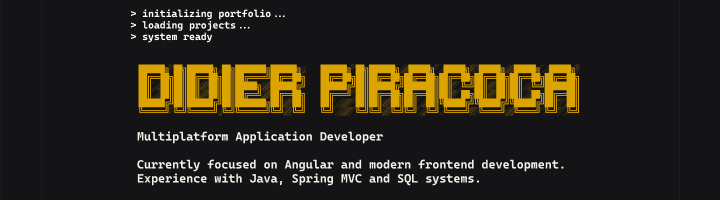

## Objetivo

Documentar la cabecera de la unica pantalla vertical `Desktop - 1` del archivo publico de Figma: [Porfolio](https://www.figma.com/design/ctzESfsjFUgqDCjR0IjpvN/Porfolio?node-id=0-1&t=5o0HOjpQ1KTQIAn9-1). La captura incluye el bloque de presentacion completo: prompt de terminal, `DIDIER PIRACOCA`, subtitulo y descripcion.

## Observaciones

- **Hecho observable:** El bloque aparece sobre un fondo casi negro, con una columna de contenido estrecha y centrada dentro del frame vertical.
- **Hecho observable:** La cabecera comienza con tres lineas de prompt: `> initializing portfolio ...`, `> loading projects ...` y `> system ready`.
- **Hecho observable:** El nombre visible es `DIDIER PIRACOCA` y usa un tratamiento grafico amarillo dorado con contorno y efecto pixelado/glitch.
- **Hecho observable:** El subtitulo visible es `Multiplatform Application Developer`.
- **Hecho observable:** La descripcion consta de dos lineas: `Currently focused on Angular and modern frontend development.` y `Experience with Java, Spring MVC and SQL systems.`
- **Hecho observable:** El texto secundario es claro, casi blanco, y el prompt comparte una apariencia monoespaciada de terminal.
- **Hecho observable:** Hay un espacio vertical breve entre el prompt, el nombre, el subtitulo y la descripcion; el nombre concentra la mayor parte del peso visual.

## Jerarquia visual

1. El titular `DIDIER PIRACOCA` domina por escala, color amarillo dorado y textura pixelada.
2. El subtitulo funciona como identificador profesional inmediato mediante un tamano menor y color claro.
3. La descripcion aporta contexto en dos lineas con menor contraste cromatico y peso visual que el titular.
4. El prompt establece primero una metafora de terminal y prepara la lectura del contenido profesional.
5. El fondo oscuro y la alineacion vertical centrada mantienen el foco en la identidad y en el mensaje inicial.

## UX y accesibilidad

- **Hecho observable:** La informacion principal se presenta visualmente como texto legible y mantiene una separacion clara entre identidad, subtitulo y descripcion.
- **Recomendacion:** En la implementacion, conservar el nombre como un `h1` real y el subtitulo y la descripcion como texto semantico, sin convertir la informacion en una imagen.
- **Recomendacion:** Tratar el prompt como decorativo si no aporta informacion funcional; en ese caso, ocultarlo a tecnologias de asistencia y mantener el contenido profesional accesible por separado.
- **Recomendacion:** Verificar contraste entre el texto claro, el amarillo del titular y el fondo oscuro con una herramienta WCAG AA. No depender unicamente del efecto glitch para comunicar el nombre.
- **Recomendacion:** Mantener un tamano de texto y una altura de linea legibles al reducir el viewport; el tratamiento pixelado del titular no debe impedir reconocer las letras.
- **Recomendacion:** Respetar el orden de lectura prompt, nombre, subtitulo y descripcion en el DOM, y conservar foco visible si se incorporan controles alrededor de esta cabecera.

## Responsive

- **Hecho observable:** La captura muestra una composicion vertical con una columna centrada y margen lateral amplio dentro del frame; no permite afirmar como responde a otros anchos.
- **Recomendacion:** Usar medidas fluidas para el ancho de la columna y el tamano del titular, con limites que eviten que las dos lineas descriptivas se vuelvan demasiado largas o demasiado estrechas.
- **Recomendacion:** Permitir que la descripcion se ajuste de forma natural y conservar el orden vertical en pantallas pequenas, sin fijar alturas que recorten el texto.
- **Recomendacion:** Revisar el espaciado y el tamano del nombre en anchos reducidos para evitar desbordamiento del efecto pixelado; la captura no muestra el comportamiento en ese caso.

## Recomendaciones para Angular

- Implementar la cabecera como un componente standalone compatible con Angular 20, con contenido estatico en la plantilla y estilos encapsulados para no afectar otras pantallas.
- Usar HTML semantico para el encabezado, el nombre, el subtitulo y la descripcion; reservar el prompt para una pequena pieza decorativa o etiquetarlo semantica y explicitamente si mas adelante representa un estado real.
- Mantener la identidad visual en CSS: fondo oscuro, tipografia monoespaciada para el prompt y el cuerpo, y un tratamiento separado para el titular. Evitar incrustar el texto en la captura.
- Aplicar layout y escalas fluidas con CSS responsive en lugar de depender de dimensiones fijas tomadas del frame de Figma.
- Si la imagen de referencia se muestra dentro de la aplicacion, usar el mecanismo de imagen optimizada de Angular para el recurso estatico; la captura de esta documentacion no requiere integracion en runtime.
- No se necesitan señales para este contenido estatico. Si los textos se vuelven configurables, tiparlos como datos de presentacion y mantener la plantilla responsable solo de la estructura.

## Captura

