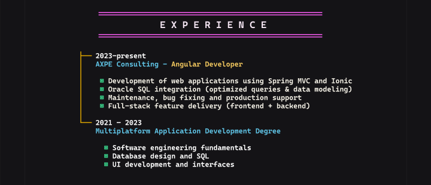

## Objetivo

Documentar el bloque `EXPERIENCE` de la unica pantalla vertical `Desktop - 1` del archivo publico de Figma: [Porfolio](https://www.figma.com/design/ctzESfsjFUgqDCjR0IjpvN/Porfolio?node-id=0-1&t=5o0HOjpQ1KTQIAn9-1). La captura se centra en el encabezado de experiencia, los dos registros visibles, sus listas y la linea amarilla lateral.

## Contenido observado

- **Hecho observable:** El encabezado visible es `EXPERIENCE` y esta entre dos lineas horizontales magenta.
- **Hecho observable:** El primer registro muestra el periodo literal `2023-present` y el texto `AXPE Consulting - Angular Developer`.
- **Hecho observable:** La lista del primer registro contiene `Development of web applications using Spring MVC and Ionic`, `Oracle SQL integration (optimized queries & data modeling)`, `Maintenance, bug fixing and production support` y `Full-stack feature delivery (frontend + backend)`.
- **Hecho observable:** El segundo registro muestra el periodo literal `2021 - 2023` y el texto `Multiplatform Application Development Degree`.
- **Hecho observable:** La lista del segundo registro contiene `Software engineering fundamentals`, `Database design and SQL` y `UI development and interfaces`.
- **Hecho observable:** Los dos registros se presentan en una misma secuencia vertical y estan conectados visualmente por una linea amarilla lateral con remates horizontales junto a los periodos.

## Composicion

- **Hecho observable:** El bloque esta organizado en una columna centrada dentro de un frame vertical, con el encabezado separado de los registros por espacio vertical.
- **Hecho observable:** La linea amarilla se ubica a la izquierda del contenido y funciona como eje temporal visual para la experiencia laboral y la formacion.
- **Hecho observable:** El registro laboral aparece antes que el registro de formacion, y cada periodo precede a su titulo y a su lista.
- **Hecho observable:** Las listas estan indentadas respecto de los titulos y usan marcadores cuadrados verdes.
- **Hecho observable:** El fondo es casi negro; el encabezado usa texto claro y reglas magenta, los titulos secundarios usan azul, `Angular Developer` usa amarillo y el cuerpo usa un tono claro.
- **Hecho observable:** El texto tiene una apariencia monoespaciada, con espaciado amplio en las letras de `EXPERIENCE` y una separacion corta entre las lineas de cada lista.

## Legibilidad

- **Hecho observable:** En la captura al 50% se distinguen el encabezado, los periodos, los titulos y las listas completas sin que el contenido quede recortado.
- **Hecho observable:** El contraste entre el texto claro y el fondo oscuro permite identificar el cuerpo de los registros; azul, amarillo, verde y magenta establecen diferencias visuales entre niveles de informacion.
- **Recomendacion:** Mantener un tamano de texto y una altura de linea suficientes para que los marcadores y las frases largas sigan siendo distinguibles al reducir el viewport.
- **Recomendacion:** Comprobar el contraste de cada color con el fondo mediante una herramienta WCAG AA y no usar el color como unico indicador de jerarquia.

## UX y accesibilidad

- **Hecho observable:** La jerarquia visual sigue el orden encabezado, periodo, titulo y lista; no se observan controles ni interacciones dentro del bloque capturado.
- **Recomendacion:** Implementar el bloque como una `section` con un `h2` para `EXPERIENCE`, registros agrupados semanticamente y listas `ul` para conservar la estructura que se ve en la captura.
- **Recomendacion:** Mantener los textos como HTML accesible y no convertir el contenido en una imagen; la linea amarilla y los colores deben ser decorativos o complementarios, no el unico medio para entender la secuencia.
- **Recomendacion:** Verificar el orden de lectura con tecnologias de asistencia y conservar foco visible si se anaden enlaces a una futura version del bloque.

## Responsive

- **Hecho observable:** La captura solo muestra una composicion vertical en un viewport concreto; no permite afirmar como responde el bloque a otros anchos o densidades.
- **Recomendacion:** Usar un ancho de columna fluido con limites y padding lateral, permitiendo que los titulos y las frases de las listas hagan wrap sin desbordarse.
- **Recomendacion:** Conservar la secuencia vertical y adaptar el espaciado entre la linea amarilla, los periodos y las listas antes que fijar una altura que pueda ocultar contenido.
- **Recomendacion:** Probar anchos moviles, zoom del navegador y textos ampliados para detectar colisiones entre la linea temporal y las listas.

## Riesgos o inconsistencias

- **Hecho observable:** Los periodos usan formatos distintos: `2023-present` no incluye espacios alrededor del guion y `2021 - 2023` si los incluye; ambos deben conservarse literalmente en esta documentacion.
- **Hecho observable:** Los textos de la experiencia estan en ingles, aunque el analisis y las recomendaciones de esta documentacion estan en espanol.
- **Riesgo:** Si la linea amarilla se implementa solo como decoracion visual, su relacion con ambos registros puede perderse para usuarios que no perciban el color o la forma.
- **Riesgo:** Las frases largas de las listas pueden cambiar la alineacion vertical de la linea y los remates en anchos reducidos si el layout depende de posiciones fijas.
- **Hecho observable:** La captura no muestra estados hover, focus, enlaces ni otras interacciones; no se deben inferir comportamientos para esos estados.

## Recomendaciones para Angular

- Implementar la seccion como un componente standalone compatible con Angular 20, con HTML semantico y estilos encapsulados.
- Mantener los dos registros como contenido estatico en la plantilla si no existe una fuente de datos; no se necesitan signals para este bloque estatico.
- Si los registros pasan a ser configurables, definir una estructura tipada para periodos, titulos y listas; usar el control de flujo moderno de Angular 20 con una clave estable al renderizar colecciones.
- Reproducir la composicion con CSS responsive, incluyendo la columna, la linea lateral, los marcadores verdes, el color, la tipografia y el espaciado, sin usar la captura como contenido de runtime.
- Usar elementos `section`, encabezados, articulos o agrupaciones equivalentes y listas reales; reservar atributos ARIA para aclarar relaciones que no queden expresadas por HTML nativo.
- Validar contraste, zoom, lectura con teclado y tecnologias de asistencia antes de considerar terminada la integracion.

## Captura

