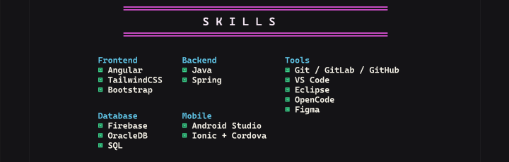

## Objetivo

Documentar el bloque `SKILLS` de la unica pantalla vertical `Desktop - 1` del archivo publico de Figma: [Porfolio](https://www.figma.com/design/ctzESfsjFUgqDCjR0IjpvN/Porfolio?node-id=0-1&t=5o0HOjpQ1KTQIAn9-1). La captura conserva el titulo y las cinco agrupaciones visibles, sin depender de la interfaz o del banner de registro de Figma.

## Inventario

- **Hecho observable - Frontend:** La agrupacion contiene `Angular`, `TailwindCSS` y `Bootstrap`.
- **Hecho observable - Backend:** La agrupacion contiene `Java` y `Spring`.
- **Hecho observable - Tools:** La agrupacion contiene `Git / GitLab / GitHub`, `VS Code`, `Eclipse`, `OpenCode` y `Figma`.
- **Hecho observable - Database:** La agrupacion contiene `Firebase`, `OracleDB` y `SQL`.
- **Hecho observable - Mobile:** La agrupacion contiene `Android Studio` e `Ionic + Cordova`.
- **Hecho observable:** Las tres primeras agrupaciones forman la fila superior: `Frontend`, `Backend` y `Tools`. `Database` y `Mobile` ocupan la segunda fila.
- **Hecho observable:** Figma muestra nombres de tecnologias y herramientas, pero no muestra porcentajes, anos de experiencia ni niveles de dominio.

## Sistema visual

- **Hecho observable:** El bloque usa un fondo casi negro y una columna de contenido centrada dentro del frame vertical.
- **Hecho observable:** `SKILLS` aparece en mayusculas, con tipografia monoespaciada, espaciado amplio entre letras y texto claro, entre reglas horizontales magenta.
- **Hecho observable:** Los nombres de las agrupaciones usan cian y las listas usan texto claro con marcadores cuadrados verdes.
- **Hecho observable:** La distribucion usa tres columnas con separacion horizontal regular. `Tools` tiene la lista mas extensa y `Database` y `Mobile` comparten la segunda fila.
- **Hecho observable:** El espaciado vertical diferencia el titulo de cada agrupacion de sus elementos y separa las dos filas visuales.

## UX y accesibilidad

- **Hecho observable:** La agrupacion por categoria permite localizar rapidamente tecnologias de frontend, backend, herramientas, bases de datos y mobile.
- **Hecho observable:** No se observan controles, enlaces, estados hover, estados focus ni interacciones dentro del bloque capturado.
- **Recomendacion:** Implementar cada agrupacion como un encabezado de tercer nivel asociado a una lista real `ul` con elementos `li`, dentro de una `section` con `h2` para `SKILLS`.
- **Recomendacion:** Mantener los nombres como texto HTML y no como parte de una imagen. El color, los marcadores y la tipografia deben reforzar la jerarquia, no ser el unico medio para distinguir categorias.
- **Recomendacion:** Verificar el contraste de texto claro, cian, verde y magenta sobre el fondo mediante WCAG AA, y revisar el resultado con zoom y texto ampliado.
- **Recomendacion:** Conservar una altura de linea suficiente para que los marcadores cuadrados y las etiquetas largas sigan siendo legibles en pantallas pequenas.

## Responsive

- **Hecho observable:** La referencia solo muestra una pantalla vertical `Desktop - 1` y una vista de Figma al 50%; no aporta evidencia sobre el comportamiento en otros anchos.
- **Riesgo:** Las etiquetas `Git / GitLab / GitHub` e `Ionic + Cordova` pueden hacer wrap o desbordarse si las columnas conservan un ancho fijo.
- **Recomendacion:** Usar una cuadricula fluida que pase de tres columnas a dos y despues a una columna segun el ancho disponible, conservando el orden Frontend, Backend, Tools, Database y Mobile.
- **Recomendacion:** Permitir el ajuste natural de los nombres y evitar alturas fijas; el numero desigual de elementos por agrupacion no debe ocultar contenido ni generar solapamientos.
- **Recomendacion:** Probar viewport movil, zoom del navegador, orientacion horizontal y textos ampliados para comprobar que el titulo, las listas y el contraste siguen siendo utilizables.

## Riesgos o inconsistencias

- **Hecho observable:** Las agrupaciones tienen distinta densidad: Frontend tiene tres elementos, Backend dos, Tools cinco, Database tres y Mobile dos.
- **Hecho observable:** La segunda fila no ocupa la tercera columna, por lo que queda espacio vacio bajo `Tools`.
- **Hecho observable:** Los textos visibles estan en ingles y la entrada `Git / GitLab / GitHub` agrupa tres nombres en un solo elemento de lista.
- **Riesgo:** Reducir demasiado la escala para conservar las tres columnas puede perjudicar la lectura de la lista de `Tools` y de los nombres compuestos.
- **Riesgo:** Interpretar la presencia de una tecnologia como un nivel de dominio, certificacion o experiencia profesional introduciria informacion que no aparece en Figma.
- **Recomendacion:** Si se modifica la distribucion en responsive, conservar la relacion visual entre cada nombre de agrupacion y sus elementos, aunque cambie el numero de columnas.

## Recomendaciones para Angular

- Implementar el bloque como un componente standalone compatible con Angular 20, con contenido semantico y estilos encapsulados; no es necesario convertir la captura en un recurso de runtime.
- Para contenido estatico, mantener una estructura de datos tipada o una plantilla sencilla sin introducir estado reactivo innecesario. Si las agrupaciones pasan a ser configurables, usar una estructura tipada de grupos y habilidades.
- Si se renderizan los grupos desde datos, usar el control de flujo moderno `@for` con una clave estable para cada agrupacion y para cada habilidad.
- Usar `section`, `h2`, `h3`, `ul` y `li` para conservar la jerarquia y la semantica de listas. Reservar ARIA para relaciones que no queden expresadas por HTML nativo.
- Reproducir el sistema visual con CSS responsive: fondo oscuro, reglas magenta, titulos cian, texto monoespaciado, marcadores verdes y una cuadricula que colapse sin recortar etiquetas.
- Validar contraste, zoom, lectura con tecnologias de asistencia y orden de lectura. La informacion debe seguir siendo comprensible sin percibir el color o la disposicion en columnas.

## Captura

