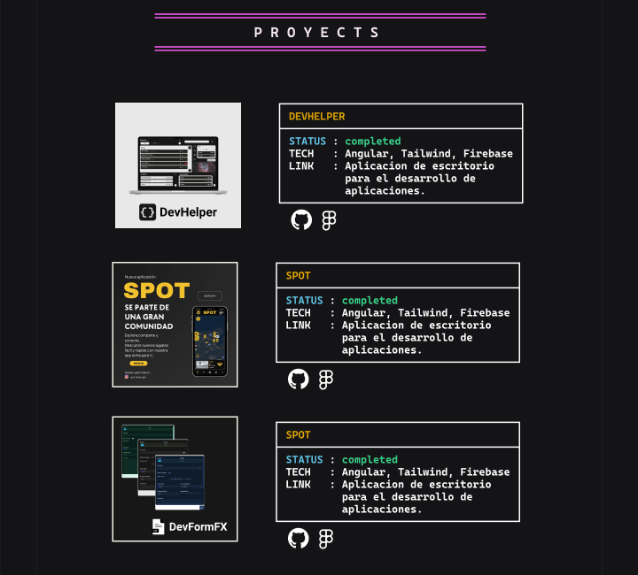

## Objetivo

Documentar el bloque `PROJECTS` de la unica pantalla vertical `Desktop - 1` del archivo publico de Figma: [Porfolio](https://www.figma.com/design/ctzESfsjFUgqDCjR0IjpvN/Porfolio?node-id=0-1&t=5o0HOjpQ1KTQIAn9-1). La captura incluye el titulo, las tres filas de tarjetas, sus miniaturas, paneles informativos e iconos de GitHub y Figma.

## Inventario de proyectos

- **Hecho observable:** La primera fila muestra la miniatura y el nombre `DevHelper`.
- **Hecho observable:** La segunda fila muestra la miniatura y el nombre `SPOT`.
- **Hecho observable:** La tercera fila muestra la miniatura y el nombre `DevFormFX`.
- **Hecho observable:** Las tres tarjetas muestran el estado literal `completed` en color verde dentro del panel informativo.
- **Hecho observable:** Los tres paneles muestran la tecnologia `Angular, Tailwind, Firebase`.
- **Hecho observable:** Los tres paneles muestran el texto de enlace `Aplicacion de escritorio para el desarrollo de aplicaciones.`.
- **Hecho observable:** Debajo de cada panel aparecen un icono de GitHub y un icono de Figma.

## Composicion de tarjetas

- **Hecho observable:** El bloque esta organizado en tres filas verticales. Cada fila relaciona una miniatura a la izquierda con un panel informativo a la derecha.
- **Hecho observable:** Las miniaturas tienen un borde claro y una escala similar entre filas; cada una combina una imagen del proyecto con su nombre en la parte inferior.
- **Hecho observable:** Cada panel tiene un borde claro, una linea horizontal bajo el nombre del proyecto y texto distribuido en las etiquetas `STATUS`, `TECH` y `LINK`.
- **Hecho observable:** El titulo de cada panel usa amarillo, `STATUS` usa cian, el valor `completed` usa verde y el resto de la informacion usa tonos claros sobre un fondo casi negro.
- **Hecho observable:** Hay espacio vertical constante entre filas y una separacion horizontal amplia entre la miniatura y el panel.
- **Hecho observable:** El titulo `PROJECTS` esta centrado entre dos reglas horizontales magenta por encima de las tarjetas.

## Jerarquia y CTA

- **Hecho observable:** La jerarquia comienza con el titulo de seccion, continua con el nombre de cada proyecto y el estado, y despues presenta tecnologia y texto de enlace.
- **Hecho observable:** El contraste de los bordes y las reglas separa las tarjetas del fondo, mientras que amarillo, cian y verde diferencian niveles de informacion dentro de cada panel.
- **Hecho observable:** Los iconos de GitHub y Figma son los unicos elementos visuales que funcionan como posibles llamadas a la accion bajo cada panel.
- **Hecho observable:** La captura no muestra etiquetas, destinos, estados hover o focus, ni permite afirmar que los iconos tengan un comportamiento de enlace implementado.
- **Recomendacion:** Mantener los iconos asociados a su proyecto y proporcionar un nombre accesible y un destino explicito cuando se implementen como enlaces.

## UX y accesibilidad

- **Hecho observable:** La relacion entre miniatura y panel se entiende por la alineacion horizontal y la repeticion de la estructura en las tres filas.
- **Hecho observable:** El estado `completed` se comunica mediante texto y color, no solo mediante el color verde.
- **Recomendacion:** Usar una `section` con un `h2` para `PROJECTS`, una agrupacion semantica por proyecto y texto HTML real para nombres, estado, tecnologia y enlace.
- **Recomendacion:** Convertir los iconos en enlaces con texto accesible o nombres accesibles equivalentes, conservar un foco visible y no depender solo del dibujo del icono para identificar GitHub o Figma.
- **Recomendacion:** Comprobar el contraste del amarillo, cian, verde, magenta y texto claro contra el fondo casi negro mediante WCAG AA.
- **Recomendacion:** Verificar que la miniatura no sea el unico medio para identificar cada proyecto y definir textos alternativos que describan su contenido sin repetir informacion innecesaria.

## Responsive

- **Hecho observable:** La referencia solo muestra una composicion vertical de `Desktop - 1` al 50%; no permite afirmar como responde a otros anchos.
- **Riesgo:** Mantener dos columnas con anchos fijos puede reducir la legibilidad de los paneles o provocar desbordamiento en pantallas estrechas.
- **Recomendacion:** Pasar cada fila a una columna en anchos moviles, manteniendo la miniatura antes del panel y conservando la asociacion entre ambos.
- **Recomendacion:** Usar medidas fluidas, `max-width`, padding lateral y alturas automaticas para permitir que el texto de `TECH` y `LINK` haga wrap sin solapamientos.
- **Recomendacion:** Mantener un area de activacion suficiente para los iconos, separar visualmente las filas y probar zoom del navegador, textos ampliados y orientacion horizontal.

## Problemas detectados

- **Hecho observable:** El panel informativo de la tarjeta cuya miniatura y nombre son `DevFormFX` muestra `SPOT` como nombre del proyecto.
- **Hecho observable:** Los textos de tecnologia y enlace aparecen repetidos en las tres tarjetas tal como se observan en Figma.
- **Hecho observable:** El texto de enlace es el mismo en `DevHelper`, `SPOT` y `DevFormFX`, y la captura no muestra URLs ni destinos concretos.
- **Hecho observable:** La captura no muestra estados hover, focus, error, carga ni otra interaccion de los iconos.
- **Recomendacion:** Revisar la correspondencia del contenido de `DevFormFX` y la reutilizacion de tecnologia y enlace antes de implementar datos definitivos, sin asumir desde esta captura cuales deberian ser los valores correctos.

## Recomendaciones para Angular

- Implementar el bloque como un componente standalone compatible con Angular 20, con contenido semantico y estilos encapsulados.
- Representar cada proyecto con una estructura tipada que incluya nombre, miniatura, estado, tecnologia, texto de enlace e iconos, sin convertir la captura en contenido de runtime.
- Si las tarjetas se renderizan desde datos, usar el control de flujo moderno `@for` con una clave estable por proyecto.
- Usar `section`, `h2`, agrupaciones de proyecto, imagenes con texto alternativo y enlaces reales; reservar ARIA para relaciones que no queden expresadas por HTML nativo.
- Reproducir la composicion con CSS responsive: dos columnas en el ancho de referencia, apilado en movil, bordes claros, reglas magenta, jerarquia cromatica y espaciado sin alturas fijas.
- Validar contraste, foco por teclado, nombres accesibles de los iconos, orden de lectura y comportamiento con zoom y tecnologias de asistencia.

## Captura

