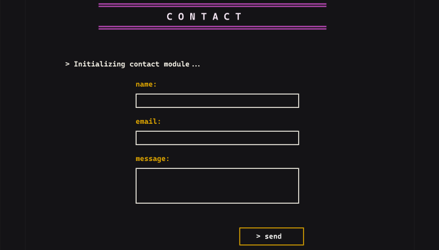

## Objetivo

Documentar el bloque `CONTACT` de la unica pantalla vertical `Desktop - 1` del archivo publico de Figma: [Porfolio](https://www.figma.com/design/ctzESfsjFUgqDCjR0IjpvN/Porfolio?node-id=0-1&t=5o0HOjpQ1KTQIAn9-1). La referencia muestra el encabezado, el texto de inicializacion, los tres campos y el boton de envio.

## Flujo visible

- **Hecho observable:** El encabezado `CONTACT` aparece en mayusculas y centrado entre reglas horizontales magenta.
- **Hecho observable:** Debajo del encabezado aparece la linea literal `> Initializing contact module ...`, con apariencia de salida de terminal.
- **Hecho observable:** El bloque presenta, en orden vertical, los labels `name:`, `email:` y `message:`, seguidos de sus areas de entrada.
- **Hecho observable:** El campo `message` es mas alto que los campos de una sola linea.
- **Hecho observable:** El boton final muestra el texto literal `> send` dentro de un borde amarillo.
- **No especificado por Figma:** La captura no define que ocurre al activar el boton ni si la linea de inicializacion representa un estado dinamico.

## Jerarquia del formulario

- **Hecho observable:** La jerarquia comienza con el titulo de seccion, continua con la linea introductoria y despues presenta los labels y controles del formulario.
- **Hecho observable:** Los campos estan apilados en una sola columna centrada dentro del frame, con separacion vertical constante.
- **Hecho observable:** El boton queda despues del textarea y se alinea hacia el extremo derecho del ancho visual de los controles.
- **Recomendacion:** Implementar un `h2` para `CONTACT`, un `form` para el conjunto de controles y un `label` asociado mediante `for` e `id` a cada control.
- **Recomendacion:** Mantener el orden de lectura `name`, `email`, `message` y `send`, sin depender de la posicion visual para entender la secuencia.

## UX y accesibilidad

- **Hecho observable:** El fondo es casi negro; el titulo y las reglas magenta, los labels amarillos y los bordes claros crean niveles visuales diferenciados.
- **Hecho observable:** La tipografia monoespaciada, el espaciado amplio del titulo y el prefijo `>` refuerzan una estetica de terminal.
- **Hecho observable:** Los campos tienen bordes claros de un pixel aproximadamente y no muestran placeholders, mensajes auxiliares ni indicadores visibles de obligatoriedad.
- **No se observa en Figma:** No hay estados de foco, error, carga, exito o envio, por lo que no se pueden afirmar validaciones ni feedback implementados.
- **Recomendacion:** Conservar labels visibles y usar tipos HTML apropiados, como `email` para el correo y `textarea` para el mensaje; definir `autocomplete` y obligatoriedad antes de implementar.
- **Recomendacion:** Asegurar un foco visible que no dependa del color amarillo, mantener contraste WCAG AA para texto, bordes y reglas, y ofrecer mensajes de error asociados al control.
- **Recomendacion:** Cuando exista feedback de envio, anunciarlo con una region accesible y mantener el foco en una posicion comprensible sin asumir que el boton ya tiene esa logica.

## Responsive

- **Hecho observable:** La unica evidencia es una pantalla vertical `Desktop - 1` observada en Figma al 50%; no permite confirmar el comportamiento en otros anchos.
- **Riesgo:** Conservar un ancho fijo para la columna o el textarea puede reducir el espacio disponible, provocar desbordamiento o hacer que el boton pierda su relacion con el formulario en pantallas estrechas.
- **Recomendacion:** Usar un ancho fluido con `max-width`, padding lateral y alturas automaticas; mantener los tres controles apilados y permitir que el texto se ajuste.
- **Recomendacion:** Mantener el titulo legible con espaciado de letras flexible, asegurar un area de activacion suficiente para `> send` y probar movil, zoom del navegador y textos ampliados.

## Riesgos o inconsistencias

- **Hecho observable:** La linea `> Initializing contact module ...` puede leerse como texto decorativo o como un estado de carga, pero la captura no aporta evidencia para decidir entre ambas interpretaciones.
- **Hecho observable:** El diseno no muestra reglas de validacion, textos de ayuda, estados del boton, destino de datos ni mensajes posteriores al envio.
- **Riesgo:** Interpretar la composicion visual como evidencia de un endpoint, una integracion de correo, persistencia, validacion o respuesta exitosa introduciria comportamiento no especificado por Figma.
- **Riesgo:** Si el color amarillo, magenta o el borde claro no alcanza contraste suficiente en el contexto final, la identificacion de labels, foco o accion puede verse afectada.
- **Recomendacion:** Definir antes de implementar la obligatoriedad, los formatos validos, los estados de envio, el feedback accesible, la politica de errores y la integracion que recibira los datos.

## Recomendaciones para Angular

- Implementar el bloque como un componente standalone compatible con Angular 20, usando HTML semantico (`section`, `h2`, `form`, `label`, `input`, `textarea` y `button`) y estilos encapsulados.
- Para un formulario real, definir un formulario reactivo tipado con los controles `name`, `email` y `message`; las reglas `required`, `email` y sus mensajes deben ser una decision de producto, no una inferencia de la captura.
- Usar `ReactiveFormsModule` y un servicio de envio solo cuando exista un contrato de integracion; la referencia de Figma no especifica endpoint, payload ni respuesta.
- Representar los estados de validacion y envio con el control de flujo moderno `@if` cuando se definan, asociando cada mensaje al control correspondiente y anunciando el resultado de forma accesible.
- Reproducir el fondo casi negro, las reglas magenta, los labels amarillos, los bordes claros y la tipografia monoespaciada mediante CSS responsive, sin convertir la captura en contenido de runtime.
- Verificar navegacion por teclado, foco visible, contraste, orden de lectura, zoom, textos ampliados y comportamiento movil antes de considerar terminado el bloque.

## Captura

